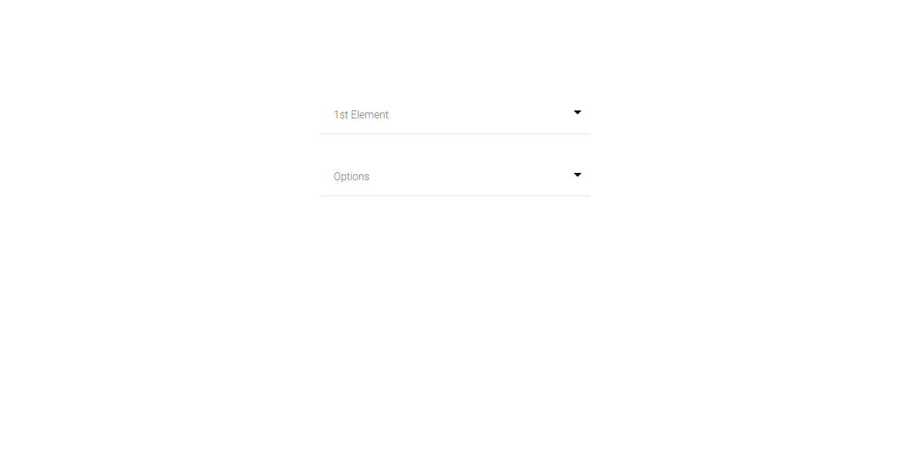
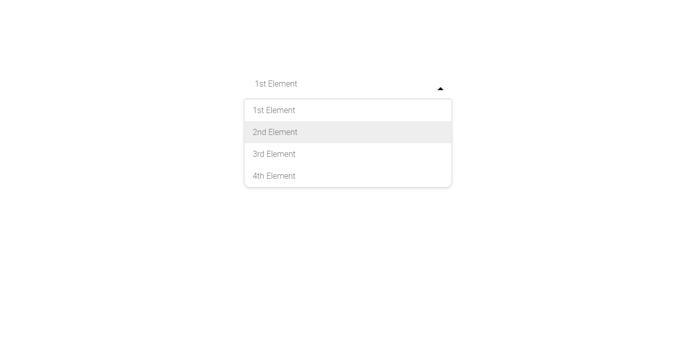
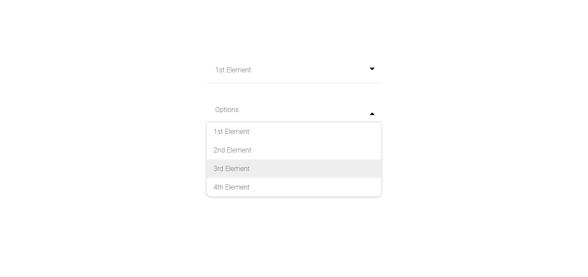

# Stylish-select-box
A simple modern select box

#### The default select box look like this:


### Extra Features
1. You can make a select box without any label by just making the value of the options anything without 'Blank'
```
<option value="1st">1st Element</option>
<option value="2nd">2nd Element</option>
<option value="3rd">3rd Element</option>
<option value="4th">4th Element</option>
```


2. You can make a select box with label by just making the value 'Blank' of the first option
```
<option value="Blank">Options</option>
<option value="1st">1st Element</option>
<option value="2nd">2nd Element</option>
<option value="3rd">3rd Element</option>
<option value="4th">4th Element</option>
```

